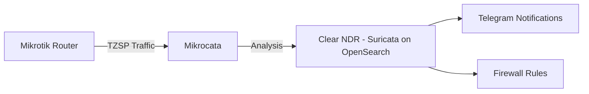
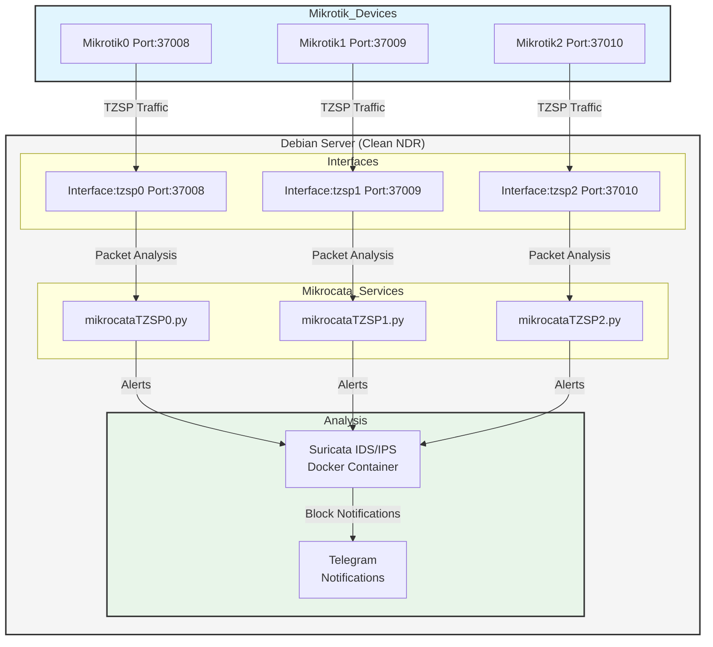

<h1 align="center">Welcome to Mikrocata2SELKS 👋</h1>
<p>
  
  <a href="https://github.com/angolo40/mikrocata2selks" target="_blank">
    
  </a>
</p>


## 📋 Introduction

Mikrocata2SELKS is a streamlined solution for integrating Mikrotik devices with a powerful Network Detection and Response (NDR) system for packet analysis.
It automates the setup process and enables efficient network traffic monitoring and threat detection.

**IMPORTANT UPDATE**: Stamus Networks has removed the SELKS repository (https://github.com/StamusNetworks/SELKS.git). As a result, this project now exclusively supports **Clear NDR** (the evolution of SELKS). SELKS installation is no longer available.



**Minimum Requirements:**
- 4 CPU cores
- 10 GB of free RAM
- Minimum 10 GB of free disk space (actual disk usage will mainly depend on the number of rules and the amount of traffic on the network - 200GB+ SSD grade recommended).

## 📚 Documentation
For a comprehensive step-by-step installation guide with detailed explanations, screenshots, and troubleshooting tips, please visit:
[Complete Installation Guide](https://www.sec-ttl.com/mikrocata2selks-integrating-mikrotik-with-suricata-for-network-security/)

## 🚀 Installation

The installation process is now fully interactive!

1. Set up a fresh Debian 12 installation on a dedicated machine (server or VM).
2. Log in as root.
3. Install Git: `apt install git`.
4. Clone this repository: `git clone https://github.com/angolo40/mikrocata2selks.git`.
5. Navigate to the repository directory: `cd mikrocata2selks`.
6. Run the interactive installer: `./easyinstall.sh`.
7. Follow the on-screen menu:
    - **Install Clear NDR**: The installer will set up Clear NDR with support for one Mikrotik device.
    - **Configure**: The script will prompt you for necessary information, like the installation path.
    - **Wait...**: The script will handle the rest.
8. Once finished, edit the configuration file (e.g., `/usr/local/bin/mikrocataTZSP0.py`) with your Mikrotik and Telegram parameters, then reload the service (e.g., `systemctl restart mikrocataTZSP0.service`).
9. Configure your Mikrotik devices as described below.

## 📡 Mikrotik Setup

1. Enable sniffer:
    ```sh
    /tool/sniffer/set filter-stream=yes streaming-enabled=yes streaming-server=[YOURDEBIANIP]:37008
    /tool/sniffer/start
    ```
2. Add firewall rules:
    ```sh
    /ip/firewall/raw/add action=drop chain=prerouting comment="IPS-drop_in_bad_traffic" src-address-list=Suricata
    /ip/firewall/raw/add action=drop chain=prerouting comment="IPS-drop_out_bad_traffic" dst-address-list=Suricata
    /ipv6/firewall/raw/add action=drop chain=prerouting comment="IPS-drop_in_bad_traffic" src-address-list=Suricata
    /ipv6/firewall/raw/add action=drop chain=prerouting comment="IPS-drop_out_bad_traffic" dst-address-list=Suricata
    ```
3. Enable Mikrotik API:
   You have two options:
   - For SSL connection (recommended):
    ```sh
    /ip/service/set api-ssl address=[DEBIANIP]
    ```
   - For non-SSL connection (default settings):
    ```sh
    /ip/service/set api address=[DEBIANIP]
    ```
   
   Then configure the corresponding settings in mikrocata.py:
   ```python
   USE_SSL = True  # Set to False for non-SSL connection
   PORT = 8728    # Default port for non-SSL. Will use 8729 if USE_SSL is True
   ALLOW_SELF_SIGNED_CERTS = False  # Set to True only if using self-signed certificates
   ```
4. Add Mikrocata user in Mikrotik:
    ```sh
    /user/add name=mikrocata2selks password=xxxxxxxxxxxxx group=full (change password)
    ```

## ⚙️ Mikrocata Configuration

After installation, you need to configure the Mikrocata script with your specific settings. Edit the configuration file:

```bash
nano /usr/local/bin/mikrocataTZSP0.py
```

### Essential Settings

1. **Mikrotik Connection:**
   ```python
   USERNAME = "mikrocata2selks"  # Mikrotik username
   PASSWORD = "password"          # Mikrotik password
   ROUTER_IP = "192.168.0.1"     # Mikrotik IP address
   ```

2. **Telegram Notifications (optional):**
   ```python
   enable_telegram = True
   TELEGRAM_TOKEN = "your_bot_token"
   TELEGRAM_CHATID = "your_chat_id"
   ```

3. **Timezone Configuration:**
   ```python
   # Set your timezone offset in hours from UTC
   TIMEZONE_OFFSET = 3  # Example: 3 for UTC+3 (Moscow), -5 for UTC-5 (EST), 0 for UTC
   ```

   This setting ensures that timestamps in Telegram notifications and MikroTik comments display in your local timezone instead of UTC.

   **Common timezones:**
   - `0` - UTC
   - `1` - CET (Central European Time)
   - `3` - MSK (Moscow Standard Time)
   - `-5` - EST (Eastern Standard Time)
   - `-8` - PST (Pacific Standard Time)
   - `8` - CST (China Standard Time)

After editing the configuration, restart the service:
```bash
systemctl restart mikrocataTZSP0.service
```

## 🛠️ Handling Multiple Mikrotik Devices

**Official Support**: The Clear NDR installation officially supports **one Mikrotik device**. The installer will automatically configure a single device setup.

**Manual Multi-Device Configuration**: While SELKS previously supported multiple Mikrotik devices out of the box, it is still possible to configure multiple devices with Clear NDR, but this must be done **manually**. Documentation for manual multi-device setup will be integrated in future updates.

For reference, a multi-device setup would involve:
- Creating additional dummy interfaces (`tzsp1`, `tzsp2`, etc.) on different ports (`37009`, `37010`, etc.)
- Creating corresponding Mikrocata service instances (`mikrocataTZSP1.py`, `mikrocataTZSP2.py`, etc.)
- Configuring each Mikrotik device to send traffic to its dedicated port

If you need to manage multiple Mikrotik devices, please wait for the official documentation or contact the maintainer for assistance.



## 💡 Features

- Installs Docker and Docker Compose.
- Installs Python.
- Installs **Clear NDR**: The next-generation open-source NDR platform.
  - **Note**: SELKS is no longer supported due to repository removal by Stamus Networks.
- Downloads and installs Mikrocata.
- Installs TZSP interface for packet capture.
- Enables notifications over Telegram when an IP is blocked.
- Includes a complete uninstallation option.

## 🔄 Changelog

- View CHANGELOG.md

## 🔧 Troubleshooting

- Check if packets are arriving at the VM from Mikrotik through the dummy interface:
    ```sh
    tcpdump -i tzsp0
    ```
- Check if mikrocata service and tzsp0 interface are up and running:
    ```sh
    systemctl status mikrocataTZSP0.service
    systemctl status TZSPreplay37008@tzsp0.service
    ```
- Check if Suricata Docker container is up and running:
    ```sh
    docker logs -f suricata
    ```
    if suricata shows 'Fatal glibc error: CPU does not support x86-64-v2' and you are under Proxmox Ve, please set CPU processor to HOST


## 📝 Notes
- Access Clear NDR web interface:
    - URL: `https://[YOURDEBIANIP]`
    - Username: clearndr
	- Password: clearndr

## 👤 Author

**Giuseppe Trifilio**

- [Website](https://github.com/angolo40/mikrocata2selks)
- [GitHub](https://github.com/angolo40)

Inspired by [zzbe/mikrocata](https://github.com/zzbe/mikrocata).

## 🤝 Contributing

Contributions, issues, and feature requests are welcome! Check the [issues page](https://github.com/angolo40/mikrocata2selks).

## 🌟 Show Your Support

Give a ⭐️ if this project helped you!

- **XMR**: `87LLkcvwm7JUZAVjusKsnwNRPfhegxe73X7X3mWXDPMnTBCb6JDFnspbN8qdKZA6StHXqnJxMp3VgRK7DcS2sgnW3wH7Xhw`
